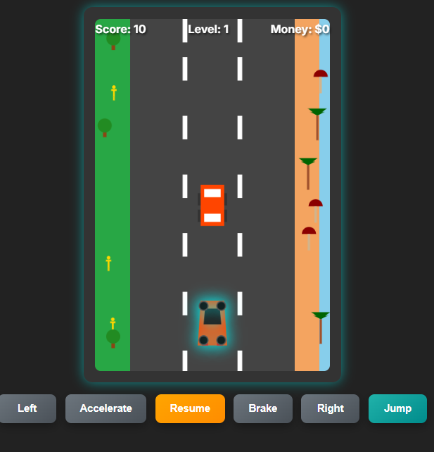

# Car Game

Car game is a website design for entertainment prupose only, is a game design for people to have fun. 
This application was build using HTML, with the of Gemini.
The following features are implemented in the project:

- The user can go left
- The user can go right
- The user can  speed up
- The user can slow dow
- The user can skip cars
- The user can see how much money they have earned
  

## Project Design:

Here's a mockup and design of the project:

## Video Walkthrough:

Here's a walkthrough of implemented features:

## Notes and Comments
The differents challenges i faced buiding the website were: making up differents directions button and  creating a nice background.

